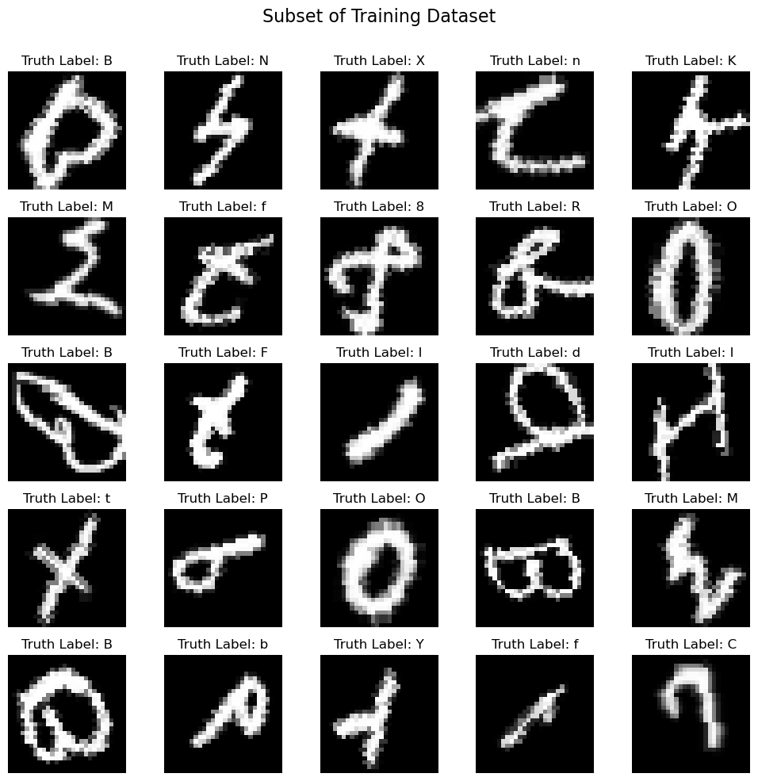
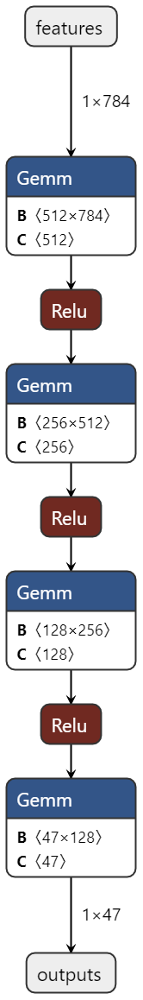
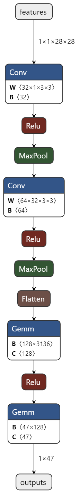
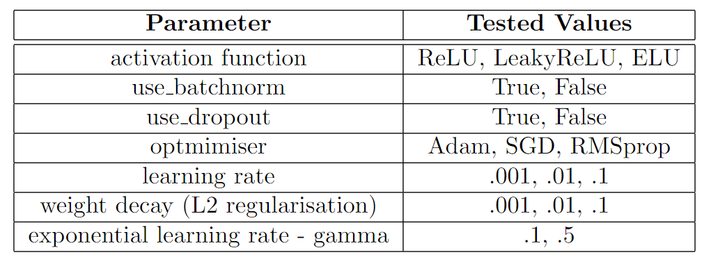
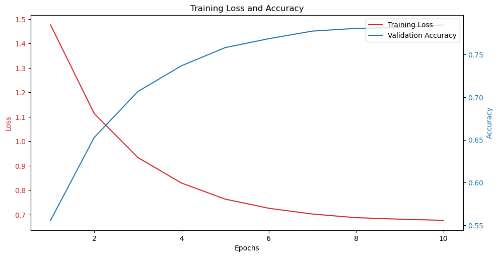
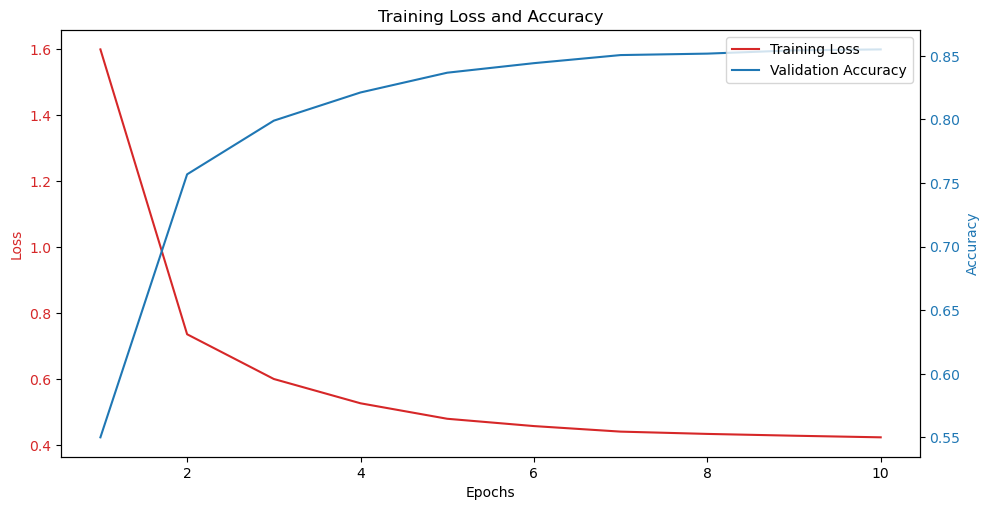
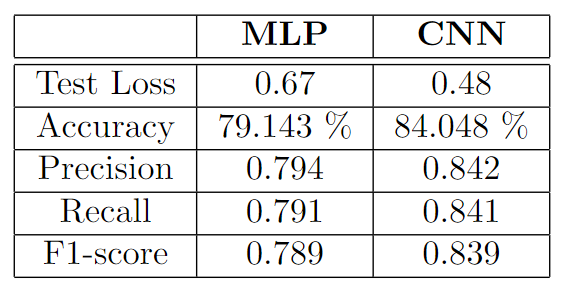
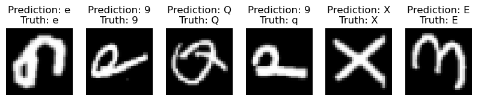

# EMNIST Dataset Classification

The EMNIST (Extended MNIST) dataset derives from the NIST Special Database 19, specifically from the MNIST database subset, and contains a set of handwritten letters and numbers converted to 28x28 pixels. The images are in greyscale, meaning they only contain 1 channel. Six different splits are provided for the dataset: ByClass,
ByMerge, Balanced, Letters, Digits and MNIST.  

For this project, the Balanced split has been used, which contains 47 classes that correspond to digits 0-9, all uppercase letters and lowercase letters except ’c’, ’i’, ’j’, ’k’, ’l’, ’m’, ’o’, ’p’, ’s’, ’u’, ’v’, ’w’, ’x’, ’y’ and ’z’. These lowercase letters have been removed from the Balanced dataset to avoid classification errors caused by the misclassification of the lowercase letters with their uppercase counterparts. The training set contains 112,799 images, and the test set contains 18,799 images. The labels in the datasets are in the first column and mapped to their respective characters using the ASCII code. The image below show 25 randomly picked images from the training set along with their true labels.

 

Figure 1: Visualisation of 25 random images from the training dataset after transformation

 

## Multilayer Perceptron (MLP) and Convolutional Neural Networks (CNN)

Two deep learning models have been constructed for the classification of the EMNIST dataset: a Multilayer Perceptron (MLP) and a Convolutional Neural Network (CNN). Both these models were created using as parent the `nn.Module` class from the `torch.nn` library, and parameters such as activation function, dropout rate, and batch normalisation were given in the `init` method to allow for hyperparameter optimisation.

### MLP Architecture

For the MLP modules, the number of fully connected layers is also given as a parameter output layer sizes by proving their sizes. In contrast, the input size is always 784 (28x28 pixels), representing the flattened images. If provided, batch normalisation has been applied to all layers, along with the activation function and dropout rate. For this project 4 fully connected layers were implemented with the option to scale up. The baseline architecture of the MLP model has been visualised with Netron and can be seen in Figure 2.

 

Figure 2: Model architecture of MLP (before hyperparameter tuning)

 

### CNN Architecture

The CNN model follows a similar structure to the MLP model. The number of convolutional layers is given as a combination of parameters (channels and kernels). For assignment 2, convolutional layers were implemented, and two fully connected layers were used at the end to reduce the number of outputs to 47, equal to the number of
classes in the Balanced Dataset. After applying the activation function on the convolutional layer, a pooling layer has been used to reduce the feature map’s spatial dimensionality for the next layer. Max Pooling has been chosen as it is widely used in image processing to extract the features/values that are highest overall, thus making it more important for training. Dropout and Batch Normalisation layers are added conditionally based on the parameters `use_dropout` and `use_batchnorm`, which are boolean. The baseline architecture of the CNN model can be seen in Figure 3.

 

Figure 3: Model architecture of CNN (before hyperparameter tuning)

 

## Hyperparameter tuning and model performance

Various hyperparameters were considered to create low-loss and high-accuracy models. In Figure 4, the tested parameters are presented. The tuning was performed using `GridSearhCV` with 5-fold cross-validation, scoring based on model accuracy, and using all available processors to run parallel jobs and reduce computational time. The total candidates for both models were 684, resulting in 3240 fits. For both hyperparameter tuning and training, ten (10) epochs were used and batches of 64 samples.

 

Figure 4: Hyperparemeters considered for optimising MLP and CNN models

 

The hyperparameter results for MLP and CNN models show that the CNN model achieved a higher best score of 83.65% (Figure 5(b)) compared to 77.86% (Figure 5(a)) for the MLP model, indicating superior performance in the CNN architecture. Both models used a similar batch size of 64 and an identical learning rate of 0.01 with Adam optimiser and a weight decay of 0.001. Even though, MLP had 4 fully-connected layers to process the image features, the CNN model employed a more complex structure with convolutional layers with multiple channels (32 and 64) and kernel sizes of 3x3, pooling and fully-connected layers, which likely contributed to its enhanced
performance. The MLP model had larger output layer sizes (256, 128, and 47) and did not use dropout. CNN’s advanced architecture and regularisation strategies appear to provide a more robust learning framework than the MLP.

 

 

Figure 5: Training loss and accuracy for the tuned MLP (a) and CNN (b) models.

 

## Evaluation and prediction

The evaluation results reflect a robust performance with low prediction error rates for both models, as seen in Figure 6. MLP had a test loss of 0.67, an accuracy of 79.143%, correctly classifying the test data about 79% of the time. CNN achieved a slightly higher accuracy of 84.048% and a lower test loss of 0.48. The precision and recall values of MLP, at 79.4% and 79.1%, respectively, suggest that the model has a good balance between identifying correct positive predictions and capturing most of the true positive instances. For CNN, both of these metrics scored higher; precision was measured at 0.842 and recall at 0.841. The F1-Score, which combines precision and recall, is 83.9% for MLP and 78.9% for CNN, confirming a balanced approach.

 

Figure 6: Comparison of prediction metrics between MLP and CNN models

 

Figure 7 illustrates the first six samples of the test set along their true and predicted labels; it can be seen that the predictions are the same both for MLP and CNN. CNN has slightly fewer misclassifications and but encounters the same pitfalls as MLP. Uppercase ’O’ (Oh) is often misclassified for zero (0), while the reverse does not happen often. Another common misclassification is that both models mistaken uppercase ’L’ (Ell) with one (1). The models often confuse lowercase ’q’ for the number 9. One last misclassification prevalent in the heatmaps within the `Juputer Notebook` is between uppercase ’F’ and lowercase ’f’.

 

 

Figure 7: First six (6) images from the test set with their true and predicted labels for the tuned MLP (a) and CNN (b) models.

 

When comparing multi-layer perceptrons (MLPs) and convolutional neural networks (CNNs), it’s apparent that CNNs are generally better suited for image classification tasks due to their architecture’s spatial awareness. CNNs consist of convolutional layers that excel at capturing local features and hierarchies, allowing them to process and analyse images more effectively. This advantage is reflected in the superior accuracy rates achieved by CNNs in the project, which started at 54.99% and reached 85.496%, along with a significant reduction in loss from 1.598 to 0.424. These results demonstrate CNNs’ capacity to detect patterns and learn from data efficiently, making them ideal for image recognition and classification tasks.

On the other hand, MLPs are more general-purpose neural networks that lack the spatial awareness inherent in CNNs. As a result, they may struggle with image-related tasks, as observed in their lower accuracy rates, which increased from 55.56% to 78.47%, and loss values that started at 1.476 and decreased to 0.677. The pros of MLPs include simplicity and flexibility, making them suitable for various tasks, but their lack of convolutional layers means they might miss crucial spatial information in image data. Overall, this project demonstrated that while MLPs and CNNs can learn and improve over time, CNNs offer a clear advantage in image classification due to their specialised architecture, suggesting that further refinement and regularisation strategies could bridge the performance gap between these two models.

